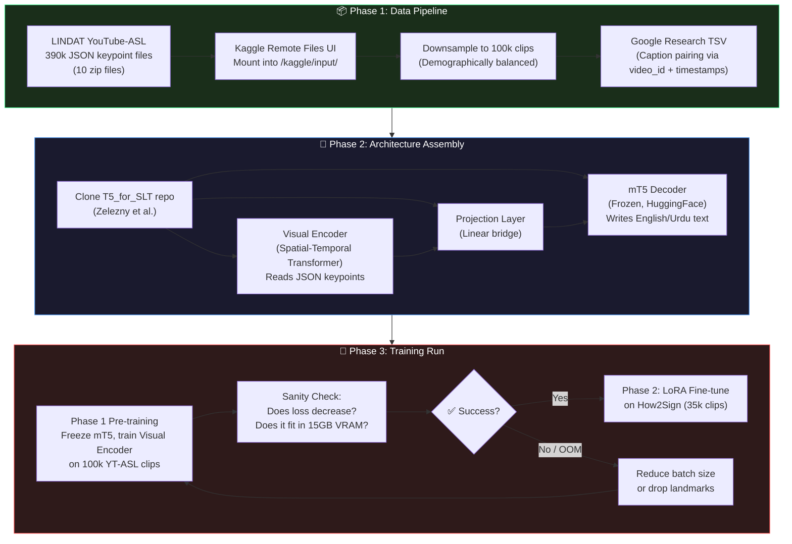

# Item 1: Prove the Pipeline — Visual Encoder + mT5 on 100k YouTube-ASL

> **Priority:** 🔥 Critical 
> **Status:** 🔴 Not Started 
> **Owner:** Khizer + Rehan 
> **Target:** Prove the full training pipeline runs without crashing on a T4 GPU (15GB VRAM)

---

## Visual Pipeline Overview

---

## Detailed Task Checklist

### Phase 1: Data Pipeline

- [ ] **1.1** Obtain the 10 direct `.zip` download URLs from the LINDAT file listing page
- [ ] **1.2** Create a public Kaggle dataset using "New Dataset → Remote Files" — paste each zip URL so Kaggle pulls files from LINDAT directly
- [ ] **1.3** Verify the Kaggle dataset mounts correctly at `/kaggle/input/<dataset-name>/`
- [ ] **1.4** Download the YouTube-ASL captions TSV from Google Research GitHub (`google-research/google-research/youtube_asl`)
- [ ] **1.5** Write a Python script to join JSON clip files to their English captions using the composite key (`video_id` + `start_timestamp` + `end_timestamp`)
- [ ] **1.6** Verify the join — spot-check 50 random clips to confirm caption alignment
- [ ] **1.7** Downsample to 100,000 clips (balanced selection — see fairness strategy)
- [ ] **1.8** Inspect the JSON structure of a sample file — confirm field names (`keypoints`, `video_id`, `start`, `end`) and landmark count (208 per frame)

### Phase 2: Architecture Assembly

- [ ] **2.1** Fork/Clone the `zeleznyt/T5_for_SLT` repository
- [ ] **2.2** Read and understand the existing data loader, model architecture, and training loop
- [ ] **2.3** Modify the decoder to use `google/mt5-small` (from HuggingFace) instead of standard T5
- [ ] **2.4** Verify the Projection Layer dimensions match between the Visual Encoder output and the mT5 embedding input
- [ ] **2.5** Inject LoRA adapter config (using `peft` library) into the mT5 decoder attention blocks — but keep disabled for Phase 1
- [ ] **2.6** Run a single forward pass with a dummy batch to confirm tensor shapes and VRAM usage

### Phase 3: Training Run (The Proof)

- [ ] **3.1** Upload the training script to a Kaggle notebook with T4 GPU enabled
- [ ] **3.2** Mount the 100k dataset and the captions TSV
- [ ] **3.3** Run Phase 1 pre-training: freeze mT5, train only the Visual Encoder + Projection Layer
- [ ] **3.4** Monitor: Does the loss decrease over 5 epochs? → If yes, the model is learning
- [ ] **3.5** Monitor: Does VRAM stay under 15GB? → If no, reduce batch size or drop face landmarks
- [ ] **3.6** Save a checkpoint to Google Drive / Kaggle output
- [ ] **3.7** Run Phase 2 fine-tuning: enable LoRA adapters, unfreeze Visual Encoder, train on How2Sign (35k clips)
- [ ] **3.8** Evaluate: compute BLEU-4 on the How2Sign test set
- [ ] **3.9** Qualitative check: manually read 20 model outputs — do they make sense?

---

## Success Criteria

| Metric | Target |
|---|---|
| Training completes without OOM crash | ✅ |
| Loss decreases over 5+ epochs | ✅ |
| VRAM usage stays under 15GB on T4 | ✅ |
| BLEU-4 on How2Sign test set | > 5.0 (prototype baseline) |
| Model generates coherent English sentences | Qualitative pass |

---

## Key Resources

| Resource | Link |
|---|---|
| T5_for_SLT Codebase | [github.com/zeleznyt/T5_for_SLT](https://github.com/zeleznyt/T5_for_SLT) |
| LINDAT YouTube-ASL Keypoints | [hdl.handle.net/11234/1-5898](http://hdl.handle.net/11234/1-5898) |
| YouTube-ASL Captions (Google) | [github.com/google-research/.../youtube_asl](https://github.com/google-research/google-research/tree/master/youtube_asl) |
| Research Paper | [arxiv.org/abs/2507.01532](https://arxiv.org/abs/2507.01532) |
| mT5 Model (HuggingFace) | [huggingface.co/google/mt5-small](https://huggingface.co/google/mt5-small) |
| Our Dataset Strategy | [dataset_strategy.md](../dataset_strategy.md) |
| Our Fairness Strategy | Notion Page — "Data Fairness & Demographic Balancing" |
