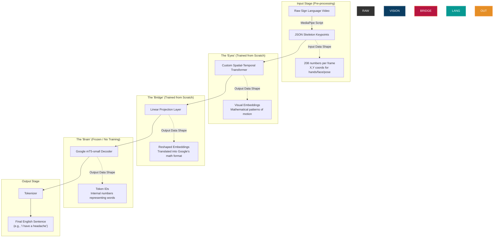

# A-PSL Architecture & Testing Blueprint

Here is the exact flow of data through our Hybrid Model, from the moment a person signs on camera to the moment the English text appears on screen.

## 1. The Hybrid Architecture Data Flow

---

## 2. What to Expect After Full Training

Once the Kaggle training loop finishes, here is what you will physically see:

1. **Decreased Loss:** The training logs will show the "Loss" number dropping from a high number (e.g., 5.0) down closer to 1.0. This is mathematical proof that the model is no longer guessing randomly (no more "Bananas!").
2. **Checkpoint Files:** You will have a `.pt` or `.bin` checkpoint file saved in your Kaggle output folder. This file contains the "brain connections" the model learned. You can download this file; it is the actual "AI" you trained.
3. **Translation Capability:** The model will now be capable of translating completely new signs that it was not trained on, as long as the vocabulary falls within what it learned.

---

## 3. How You Will Test It

We will test the model in two different ways depending on what stage we are at.

### A. The "Development" Test (Inside Kaggle)
Right after training finishes, we don't need a camera to test it. 
1. We take 1,000 JSON skeleton clips from the YouTube-ASL dataset that we intentionally hid from the model during training (the Validation Set).
2. We feed the raw numbers of Clip #1 into the model.
3. We print the model's output to the screen next to the real answer.
   * *Actual Answer:* "The quick brown fox."
   * *Model Output:* "A fast brown fox."
4. If they are close, the model is successfully learning the language!

### B. The "Live MVP" Test (Your Laptop Webcam)
When we are ready for the final project demo, we will test it live.
1. You run a Python script on your laptop. It turns on your webcam.
2. The script runs Google MediaPipe in the background. As you move your hands on camera, MediaPipe instantly extracts the 208 coordinates 30 times a second.
3. The script grabs those live numbers and feeds them instantly into the `.pt` checkpoint file we downloaded from Kaggle.
4. The model processes the numbers and prints the English text on your screen in real-time as you sign.