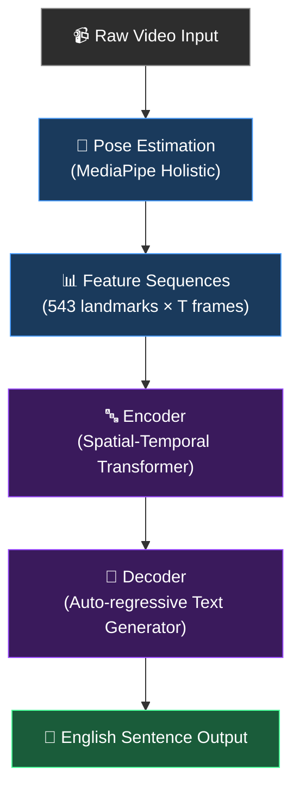
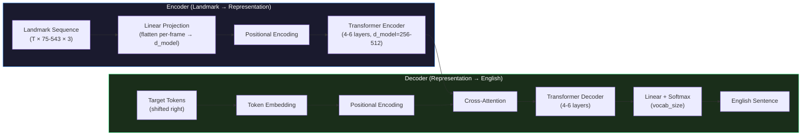
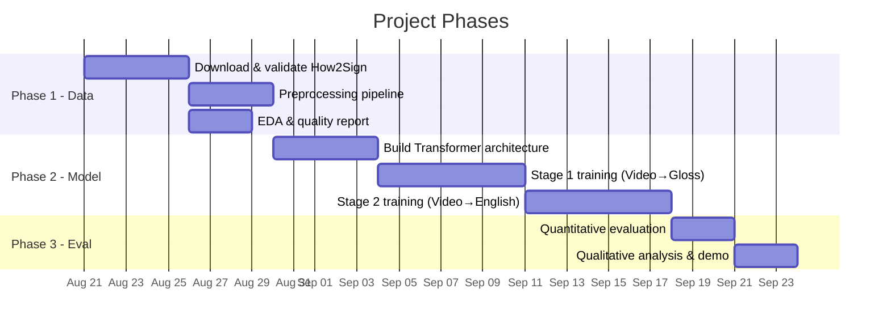

# ASL Video → English Translation: Project Blueprint

---

## 1. Executive Summary

**Objective:** Build a model that accepts a continuous American Sign Language (ASL) video as input and produces its English sentence translation as output.

**Constraints:**
| Parameter | Decision |
|---|---|
| Target Language | American Sign Language (ASL) |
| Domain | General everyday conversation |
| Compute | Google Colab / Kaggle (T4 GPU, 15 GB VRAM). Colab Pro as fallback. |
| Collaboration | Two agents (Khizer + Rehan) coordinating via `exiledftw/A-PSL` |

**Approach:** We will use a **pose-landmark-based** pipeline. Instead of feeding raw video frames (which would be computationally infeasible on a T4), we will extract skeletal keypoints using **Google MediaPipe Holistic** and train a **Transformer encoder-decoder** on these lightweight feature sequences.

---

## 2. The Problem, Decomposed

Translating sign language video to English is not a single problem — it is a stack of subproblems. Understanding this stack is critical to making sound architectural decisions.



| Subproblem | What it solves | Our approach |
|---|---|---|
| **Visual Feature Extraction** | Reducing a high-dimensional video tensor into meaningful spatial features | MediaPipe Holistic (543 landmarks per frame) |
| **Temporal Modeling** | Understanding how signs *change over time* to form words/phrases | Transformer Encoder with positional encoding |
| **Sequence-to-Sequence Translation** | Mapping a variable-length sign sequence to a variable-length English sentence | Transformer Decoder with cross-attention |
| **Alignment** | Handling the fact that ASL grammar ≠ English grammar (different word order, no articles, spatial references) | Attention mechanism learns soft alignment |

---

## 3. Dataset Strategy

### 3.1 Why Dataset Choice is Critical

> [!CAUTION]
> Sign language translation is a **low-resource** problem. Unlike text translation (billions of sentence pairs), the largest ASL video-text datasets have only tens of thousands of clips. Every decision about which dataset to use, how to preprocess it, and how to augment it will have an outsized impact on final model quality.

### 3.2 Dataset Comparison Matrix

| Dataset | Type | Scale | Annotations | Signers | Environment | Storage | Feasibility (T4) |
|---|---|---|---|---|---|---|---|
| **How2Sign** | Continuous | 80+ hrs, ~35K clips | English text, Glosses, 2D/3D keypoints | 11 | Studio (green screen) | ~290 GB (full RGB) / ~20-30 GB (clips+keypoints) | ✅ High (pre-extracted features available) |
| **YouTube-ASL** | Continuous | ~1,000+ hrs | English text (auto-aligned) | 100s | In-the-wild | Very large (TBs) | ⚠️ Medium (noisy, needs heavy filtering) |
| **OpenASL** | Continuous | ~200 hrs | English text | 200+ | In-the-wild | Large | ⚠️ Medium |
| **WLASL** | Isolated (word-level) | 2,000 words, ~21K clips | Word labels | 100+ | Mixed | ~15 GB | ❌ Wrong task (word-level, not sentences) |
| **MS-ASL** | Isolated (word-level) | 1,000 signs, ~25K clips | Word labels | 222 | Mixed | Moderate | ❌ Wrong task |

### 3.3 Recommended Dataset: How2Sign

> [!TIP]
> **How2Sign** is our best option for the following reasons:
> - It provides **pre-extracted MediaPipe keypoints** on Hugging Face and Kaggle (~20-30 GB), meaning we may not even need to run pose extraction ourselves.
> - It includes **gloss annotations**, enabling the more powerful Video → Gloss → Text training pipeline.
> - Its **35K sentence-level clips** are well-aligned and high quality.
> - It is the most cited benchmark for continuous ASL translation, so we can compare our results against published baselines.

**Where to get it:**
- Official site: `how2sign.github.io`
- Pre-extracted features: Hugging Face (`how2sign` datasets) and Kaggle
- Metadata: TSV/CSV files mapping clip IDs → sentences → glosses

### 3.4 Data Anatomy (How2Sign)

Each sample in our training set will consist of:

```
┌─────────────────────────────────────────────────────┐
│  Sample                                              │
│                                                      │
│  ┌──────────────────────────────────┐                │
│  │  Input: Landmark Sequence        │                │
│  │  Shape: (T, 543, 3)              │                │
│  │  T = number of frames (variable) │                │
│  │  543 = MediaPipe landmarks       │                │
│  │  3 = (x, y, z) coordinates       │                │
│  └──────────────────────────────────┘                │
│                                                      │
│  ┌──────────────────────────────────┐                │
│  │  Intermediate: Gloss Sequence    │                │
│  │  e.g., "BOY PLAY BALL"           │                │
│  └──────────────────────────────────┘                │
│                                                      │
│  ┌──────────────────────────────────┐                │
│  │  Target: English Sentence        │                │
│  │  e.g., "The boy is playing       │                │
│  │         with the ball."          │                │
│  └──────────────────────────────────┘                │
└─────────────────────────────────────────────────────┘
```

**Landmark breakdown (543 total per frame):**

| Body Part | Landmark Count | Why it matters |
|---|---|---|
| Left Hand | 21 | Primary articulators for signs |
| Right Hand | 21 | Primary articulators for signs |
| Pose (Body/Arms) | 33 | Arm position, shoulder orientation, torso reference |
| Face Mesh | 468 | Eyebrow raise = question, lip patterns = mouth morphemes |

---

## 4. Data Processing Pipeline

### Phase 1: Data Acquisition & Validation

```
Step 1 ─► Download How2Sign pre-extracted keypoints (Kaggle/HuggingFace)
Step 2 ─► Download metadata CSVs (clip_id, gloss, english_text, split)
Step 3 ─► Validate: ensure every clip_id in metadata has a corresponding .npy file
Step 4 ─► Report: total samples per split (train/val/test), sequence length distribution
```

### Phase 2: Preprocessing

```
Step 5 ─► Normalize landmarks:
           • Center all coordinates relative to the mid-shoulder point
           • Scale to [-1, 1] range based on torso height
           • This makes the model invariant to signer position/size in frame

Step 6 ─► Handle variable-length sequences:
           • Compute sequence length histogram
           • Set a max_seq_length (e.g., 95th percentile)
           • Pad shorter sequences, truncate longer ones

Step 7 ─► Feature selection (optional optimization):
           • If T4 memory is tight, drop face mesh landmarks (468)
           • Keep only hands (42) + pose (33) = 75 landmarks
           • This reduces input from 1,629 features/frame to 225 features/frame
```

### Phase 3: Text Processing

```
Step 8 ─► Tokenize English sentences using a BPE tokenizer (e.g., SentencePiece)
Step 9 ─► Process Gloss Sequences:
           • If gloss is missing for a clip, use the Gemini API to automatically translate the English text into an ASL gloss representation.
           • Tokenize Gloss sequences (simple whitespace tokenization + vocabulary mapping)
Step 10 ─► Add special tokens: <BOS>, <EOS>, <PAD>
Step 11 ─► Build vocabulary files and save
```

---

## 5. Model Architecture (Proposed)

> [!NOTE]
> This architecture is designed to be trainable on a single T4 GPU (15 GB VRAM) with mixed-precision (FP16) training. We use gradient accumulation to simulate larger batch sizes.

### 5.1 Architecture Diagram



### 5.2 Hyperparameter Budget (T4-Optimized)

| Hyperparameter | Conservative (start here) | Aggressive (if memory allows) |
|---|---|---|
| `d_model` | 256 | 512 |
| `n_heads` | 4 | 8 |
| `encoder_layers` | 4 | 6 |
| `decoder_layers` | 4 | 6 |
| `d_ff` | 1024 | 2048 |
| `batch_size` | 8 | 16 (with grad accumulation) |
| `learning_rate` | 1e-4 (with warmup) | 3e-4 |
| `precision` | FP16 (mixed) | FP16 (mixed) |
| `max_seq_length` (landmarks) | 300 frames | 500 frames |
| **Est. model size** | **~15-25M params** | **~50-80M params** |
| **Est. VRAM usage** | **~6-8 GB** | **~12-14 GB** |

---

## 6. Training Strategy

### 6.1 Two-Stage Training (Recommended)

Because direct Video → English translation is extremely hard with limited data, we will train in two stages:

**Stage 1: Sign Recognition (Video → Gloss)**
- Train the encoder to predict gloss sequences using CTC loss
- This teaches the model *what signs are being performed*
- Easier task, converges faster

**Stage 2: Translation (Video → English)**
- Fine-tune the full encoder-decoder to produce English sentences
- Cross-entropy loss on the decoder output
- The encoder is already "warm" from Stage 1

### 6.2 Training Logistics on Colab/Kaggle

| Concern | Mitigation |
|---|---|
| **Session time limits** (Colab free: ~12 hrs) | Save checkpoints every N epochs to Google Drive. Resume training across sessions. |
| **Data loading speed** | Pre-load all `.npy` files into memory if they fit, or use memory-mapped arrays. |
| **Memory overflow** | Mixed-precision (FP16) + gradient accumulation (effective batch = 32 with actual batch = 8, accumulation = 4) |
| **Reproducibility** | Fix random seeds, log all hyperparams, version-control configs |

---

## 7. Evaluation Metrics

| Metric | What it measures | Target (baseline) |
|---|---|---|
| **BLEU-4** | N-gram overlap between predicted and reference English text | > 8.0 (state-of-art on How2Sign is ~10-12) |
| **ROUGE-L** | Longest common subsequence overlap | > 20.0 |
| **WER (Gloss)** | Word Error Rate on gloss prediction (Stage 1) | < 50% |
| **Human Evaluation** | Does the translation make semantic sense? | Qualitative spot-checks |

---

## 8. Phased Milestones & Task Division



### Suggested Task Division (Khizer + Rehan)

| Phase | Khizer's Agent (this agent) | Rehan's Agent |
|---|---|---|
| **Phase 1** | Download scripts, data validation, metadata parsing | Preprocessing pipeline (normalization, padding, feature selection) |
| **Phase 2** | Transformer architecture design, training loop | Tokenization, data loaders, evaluation metrics |
| **Phase 3** | Quantitative benchmarking | Demo notebook, qualitative analysis |

> [!IMPORTANT]
> This task division is a suggestion. Both teams should review and agree before starting execution.

---

## 9. Risk Analysis

| Risk | Likelihood | Impact | Mitigation |
|---|---|---|---|
| T4 runs out of VRAM during training | Medium | High | Start with conservative hyperparams (d_model=256). Use feature selection to drop face mesh if needed. |
| How2Sign download links are broken/moved | Low | High | Check Kaggle and HuggingFace mirrors first. Cache everything to Google Drive immediately. |
| Model underfits (BLEU < 3) | Medium | Medium | Ensure Stage 1 (gloss recognition) works first. If encoder can't recognize signs, translation will fail. |
| Colab session disconnects mid-training | High | Medium | Checkpoint every 2 epochs. Write a resume-from-checkpoint script. |
| Pose estimation artifacts in pre-extracted data | Low | Medium | Visually inspect random samples. Filter out clips with >20% missing landmarks. |

---

## 10. Verification Plan

### Automated Tests
- Verify all `.npy` landmark files load correctly and have the expected shape `(T, 543, 3)`
- Verify metadata CSV parsing produces matching counts for train/val/test splits
- Run a single forward pass through the model with a dummy batch to confirm shapes and memory usage
- Train for 5 epochs on a tiny subset (100 samples) to verify the loss decreases

### Manual Verification
- Overlay extracted landmarks on 50 random video frames to visually confirm quality
- Read 20 random gloss annotations and verify they semantically match the English translations
- After training, manually inspect 50 model outputs for coherence

---

## 11. Open Items for Team Discussion

> [!WARNING]
> These items require alignment between both teams before we begin execution.

1. **Feature Selection Trade-off:** Should we start with all 543 landmarks (more information, higher memory) or just hands+pose (75 landmarks, faster training)? Recommendation: Start with 75, add face later if needed.
2. **Gloss Dependency / Generation:** For any missing or incomplete gloss annotations in How2Sign, we will utilize the Gemini API to automatically generate the ASL gloss from the English sentence. We need to finalize the prompt/setup for this API call.
3. **Task Division Agreement:** Does Rehan's team agree with the suggested split in Section 8?